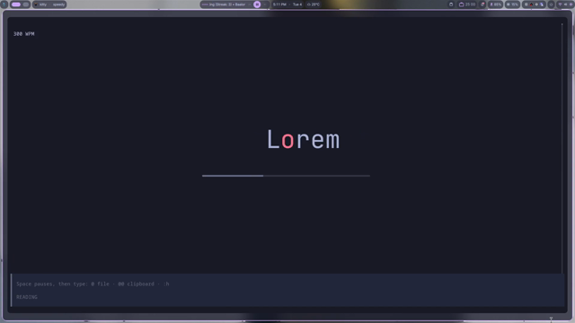

# Speedy

**A terminal-based RSVP (Rapid Serial Visual Presentation) speed reader.**

Speedy shows words one at a time at a fixed screen position. It renders text as images via the Kitty Graphics Protocol, which lets it position each word precisely (important for the OVP anchor — see below) instead of relying on the terminal's character grid.

[](https://github.com/henrythdu/Speedy/actions/workflows/ci.yml)
[](LICENSE)

[](assets/demo.mp4)

---

## Table of Contents

- [Features](#features)
- [Requirements](#requirements)
- [Installation](#installation)
- [Quick Start](#quick-start)
- [Usage](#usage)
- [Keybindings](#keybindings)
- [Configuration](#configuration)
- [Project Structure](#project-structure)
- [Troubleshooting](#troubleshooting)
- [Contributing](#contributing)
- [License](#license)

---

## Features

- **RSVP reading**: words displayed one at a time at your configured WPM
- **OVP anchoring**: each word is shifted horizontally so its anchor letter stays at the same screen position, reducing eye movement between words
- **Weighted timing**: punctuation and long words get longer display times for a natural rhythm
- **File support**: PDF, EPUB, and clipboard text
- **Sentence navigation**: jump forward/backward to sentence starts
- **Progress indicators**: a bar showing progress through the current sentence, and a strip on the right edge showing progress through the document
- **Six color themes**, switchable at runtime
- **LRU word cache** with a 100MB memory cap so repeated words aren't re-rasterized

---

## Requirements

### Terminal (Required)

Speedy requires a terminal with **Kitty Graphics Protocol** support:

| Terminal | Version | Status |
|----------|---------|--------|
| **Kitty** | Any | ✅ Recommended |
| **Konsole** | 22.04+ | ✅ Supported |

Text rendering is done as images because the RSVP word needs to be placed at arbitrary pixel positions; standard terminal text is locked to the character grid.

### System

- **Rust**: 1.70+ (for building from source)
- **OS**: Linux, macOS (Windows support planned)

### Minimum Terminal Size

- 80 columns × 24 rows

---

## Installation

Speedy is not published on crates.io (the `speedy` name there is an unrelated
serialization crate) — build from source. The binary is self-contained: the
JetBrains Mono font is embedded at compile time, so there are no assets to
install alongside it.

### From Source

```bash
# Clone the repository
git clone https://github.com/henrythdu/Speedy.git
cd Speedy

# Build and install to ~/.cargo/bin (release mode by default)
cargo install --path .
```

Or build a release binary in-tree:

```bash
cargo build --release
./target/release/speedy
```

---

## Quick Start

1. **Launch Speedy:**

   ```bash
   speedy
   ```

2. **Load a file** (in the command deck at the bottom):

   ```text
   @document.pdf
   ```

3. Reading starts automatically at 300 WPM.

4. **Control your reading:**
   - `Space` to pause/resume
   - `]` to increase WPM, `[` to decrease
   - `j` / `k` to jump forward/backward one sentence
   - Pause first, then the command deck at the bottom accepts input
     (`@file`, `:q`, `:h`)

---

## Usage

### Command Deck

Speedy has a command deck at the bottom of the terminal. While Reading it
sits dimmed; press `Space` to pause and it becomes the active input — type
directly, no key needed to "open" it.

#### Loading Files

| Command | Description |
| --------- | ------------- |
| `@path/to/file.pdf` | Load a PDF file |
| `@path/to/book.epub` | Load an EPUB file |
| `@@` | Load text from clipboard |

#### File Autocomplete

When typing `@`, a popup appears with file suggestions:

- **↑/↓**: Navigate file list
- **Enter/Tab**: Select file
- **Esc**: Cancel
- **Ctrl+R**: Refresh file cache

#### Commands

| Command | Description |
|---------|-------------|
| `:q` or `:quit` | Exit application |
| `:h` or `:help` | Show the help overlay (keybindings, progress indicators, themes) |

#### Themes

`Ctrl+P` opens the settings popup — arrow keys to select, `←/→` to change.
The six themes are also listed in [Configuration](#configuration).

---

## Keybindings

### Reading / Paused Mode

| Key | Action |
| ----- | -------- |
| `Space` or `p` | Pause / Resume |
| `]` | Increase WPM by 50 |
| `[` | Decrease WPM by 50 |
| `j` | Jump forward one sentence |
| `k` | Jump backward one sentence |

Paused is when the deck accepts input — type `@file`, `:q`, or `:h`
directly (Space / `p` still resume).

### Command Mode

| Key | Action |
| ----- | -------- |
| `Enter` | Execute command |
| `Esc` | Cancel / leave command mode |
| `Backspace` | Delete last character |

---

## Configuration

Speedy supports configuration via TOML files and command-line flags. All settings have defaults, so configuration is optional.

### CLI Flags

| Flag | Description |
|------|-------------|
| `-c, --config <PATH>` | Load configuration from a custom file path |
| `--list-themes` | List all available themes and exit |

```bash
# Use a custom config file
speedy --config ./my-config.toml

# List available themes
speedy --list-themes
```

### Config File Location

Speedy looks for configuration at platform-specific locations:

| Platform | Path |
| ---------- | ------ |
| **Linux** | `~/.config/speedy/config.toml` |
| **macOS** | `~/Library/Application Support/speedy/config.toml` |
| **Windows** | `%APPDATA%\speedy\config.toml` |

If no config file exists, Speedy uses built-in defaults.

### Available Themes

| Theme | Description |
| ------- | ------------- |
| `tokyo-night` | Dark, blue-purple (default) |
| `dracula` | Dark, purple accent |
| `gruvbox` | Warm retro palette |
| `catppuccin-mocha` | Dark pastel |
| `nord` | Dark, bluish |
| `light` | Light background |

### Timing Parameters

Control reading speed and punctuation pauses in the `[timing]` section:

| Parameter | Default | Range | Description |
| ----------- | --------- | ------- | ------------- |
| `wpm` | 300 | 50-1000 | Words per minute reading speed |
| `period_multiplier` | 3.0 | any | Extra pause after periods (.) |
| `comma_multiplier` | 1.5 | any | Extra pause after commas (,) |
| `question_multiplier` | 3.0 | any | Extra pause after question marks (?) |
| `exclamation_multiplier` | 3.0 | any | Extra pause after exclamation marks (!) |
| `newline_multiplier` | 4.0 | any | Extra pause at line breaks |
| `long_word_threshold` | 10 | any | Characters before a word counts as "long" |
| `long_word_penalty` | 1.15 | any | Extra time multiplier for long words |

### Example Configuration

Create a config file with your preferred settings:

```toml
# ~/.config/speedy/config.toml

# Theme selection (tokyo-night, dracula, gruvbox, catppuccin-mocha, nord, light)
theme = "tokyo-night"

[timing]
# Reading speed in words per minute (50-1000)
wpm = 350

# Punctuation pause multipliers
period_multiplier = 3.0
comma_multiplier = 1.5
question_multiplier = 3.0
exclamation_multiplier = 3.0
newline_multiplier = 4.0

# Long word handling
long_word_threshold = 10
long_word_penalty = 1.15
```

See [example_config.toml](example_config.toml) in the repository for a fully commented example with all options.

### Environment Variables

| Variable | Description | Default |
|----------|-------------|---------|
| `RUST_LOG` | Logging level | `info` |

```bash
RUST_LOG=debug speedy
```

---

## Project Structure

```
src/
├── app/           # Application state
├── reading/       # RSVP logic (tokens, timing, sentence detection)
├── rendering/     # Kitty protocol, rasterization, viewport
├── ui/            # TUI layer (ratatui): parts/, popups, event loop
├── input/         # File parsing (PDF, EPUB, clipboard)
└── main.rs        # Entry point
```

Code is organized into cells (see [AGENTS.md](AGENTS.md)) — each cell owns a
context-bounded piece of the app, and `.cells/` records the dependencies
between them. UI parts live in `src/ui/parts/`: one file per visible element
(word, progress indicators, background, command deck).

---

## Troubleshooting

### "Terminal does not support Kitty Graphics Protocol"

**Solution**: Use Kitty or Konsole (22.04+). Other terminals are not supported.

### Text appears garbled or misaligned

1. Ensure you're using a supported terminal
2. Try resizing the terminal and restarting
3. Check that your terminal font size is reasonable (12-16pt recommended)

### File not loading

1. Check the file path is correct
2. Ensure the file is a valid PDF or EPUB
3. Some PDFs with complex layouts may not extract text cleanly

---

## Contributing

Contributions are welcome!

### Development Setup

```bash
# Clone and build
git clone https://github.com/henrythdu/Speedy.git
cd Speedy
cargo build

# Run tests
cargo test

# Run with debug logging
RUST_LOG=debug cargo run
```

### Code Quality

```bash
# Format code
cargo fmt

# Lint
cargo clippy -- -D warnings
```

---

## License

This project is dual-licensed under:

- **MIT License**
- **Apache License 2.0**

### Bundled Font

This project bundles **JetBrains Mono**, which is licensed under the SIL Open Font License 1.1.

See [licenses/JetBrainsMono-LICENSE.txt](licenses/JetBrainsMono-LICENSE.txt) for the full license text.

Copyright 2020 The JetBrains Mono Project Authors  
<https://github.com/JetBrains/JetBrainsMono>
